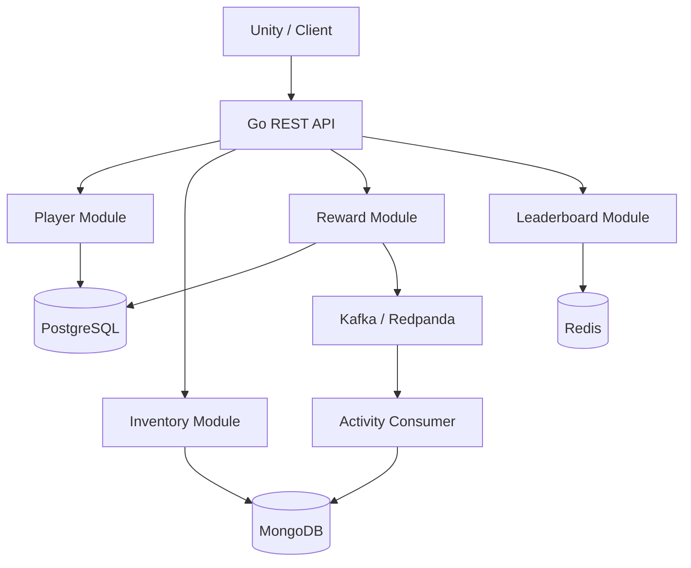

# Game Backend Services

Portfolio backend game menggunakan **Go modular monolith**. Proyek ini sengaja dimulai tanpa microservices: boundary modul dibuat jelas terlebih dahulu, lalu kompleksitas distribusi baru layak ditambahkan ketika ada kebutuhan nyata.

## Fitur

- Player: registrasi, melihat profil, dan mengganti username.
- Inventory: melihat, menambah, dan mengurangi item secara atomic.
- Reward: login, battle, dan quest reward dengan transaksi serta idempotency key.
- Leaderboard: mengirim skor terbaik dan melihat peringkat pemain.
- Activity log: event reward dikirim melalui Kafka dan disimpan consumer ke MongoDB.
- Health/readiness checks, graceful shutdown, structured logs, dan validasi request.
- Docker Compose untuk menjalankan seluruh stack dengan satu perintah.

## Arsitektur



| Teknologi | Tanggung jawab |
| --- | --- |
| PostgreSQL | Player dan reward history |
| MongoDB | Inventory dan activity log |
| Redis | Global leaderboard |
| Kafka/Redpanda | Event `reward.granted` |

Redpanda digunakan sebagai broker yang kompatibel dengan protokol Kafka agar lingkungan lokal lebih ringan. Aplikasi Go tetap memakai Kafka client biasa.

## Menjalankan Proyek

Prasyarat: Docker dan Docker Compose.

```bash
docker compose up --build
```

PostgreSQL, MongoDB, Redis, dan Kafka diekspos masing-masing pada port `15432`, `27018`, `16379`, dan `19092` agar tidak mudah bentrok dengan instalasi lokal standar.

Tunggu sampai service `api` berstatus healthy, lalu cek:

```bash
curl http://localhost:8080/readyz
```

Untuk menghentikan stack:

```bash
docker compose down
```

Tambahkan `-v` hanya jika Anda memang ingin menghapus seluruh data lokal.

## Melihat Database di VS Code

Workspace sudah menyediakan rekomendasi extension dan koneksi PostgreSQL untuk
VS Code. Panduan membuka PostgreSQL, MongoDB, dan Redis tersedia di
[`docs/vscode-database.md`](docs/vscode-database.md).

## Swagger UI

Dokumentasi interaktif tersedia setelah API berjalan:

```text
http://localhost:8080/docs/
```

Swagger UI menampilkan schema request/response, parameter, status code, dan tombol **Try it out** untuk mencoba seluruh endpoint langsung dari browser. Spesifikasi hasil generate juga tersedia di:

```text
http://localhost:8080/docs/doc.json
```

Setelah mengubah anotasi endpoint, perbarui dokumentasi dengan:

```bash
make swagger
```

## Contoh Alur API

### 1. Buat player

```bash
curl -sS -X POST http://localhost:8080/api/v1/players \
  -H 'Content-Type: application/json' \
  -d '{"username":"game_dev"}'
```

Simpan nilai `id` dari response sebagai `PLAYER_ID` untuk contoh berikutnya.

### 2. Ambil profil

```bash
curl -sS http://localhost:8080/api/v1/players/$PLAYER_ID
```

### 3. Berikan quest reward

```bash
curl -sS -X POST http://localhost:8080/api/v1/players/$PLAYER_ID/rewards \
  -H 'Content-Type: application/json' \
  -H 'Idempotency-Key: quest-001-player-1' \
  -d '{"type":"quest"}'
```

Mengirim ulang request dengan idempotency key yang sama tidak akan menggandakan Gold, EXP, atau item.

Reward bawaan:

| Type | Gold | EXP | Item |
| --- | ---: | ---: | --- |
| `login` | 100 | 25 | - |
| `battle` | 50 | 100 | - |
| `quest` | 200 | 250 | 1 Health Potion |

### 4. Lihat inventory

```bash
curl -sS http://localhost:8080/api/v1/players/$PLAYER_ID/inventory
```

Menambah dan mengurangi item secara manual:

```bash
curl -sS -X POST http://localhost:8080/api/v1/players/$PLAYER_ID/inventory/items \
  -H 'Content-Type: application/json' \
  -d '{"item_id":"iron-sword","name":"Iron Sword","quantity":1}'

curl -i -X DELETE \
  'http://localhost:8080/api/v1/players/'$PLAYER_ID'/inventory/items/iron-sword?quantity=1'
```

### 5. Kirim skor dan lihat leaderboard

```bash
curl -sS -X POST http://localhost:8080/api/v1/leaderboard/scores \
  -H 'Content-Type: application/json' \
  -d '{"player_id":"'$PLAYER_ID'","score":4200}'

curl -sS 'http://localhost:8080/api/v1/leaderboard?limit=10'
```

Leaderboard hanya menyimpan skor tertinggi setiap player; skor yang lebih rendah tidak menimpa skor lama.

## Endpoint

| Method | Path | Keterangan |
| --- | --- | --- |
| `GET` | `/healthz` | Liveness API |
| `GET` | `/readyz` | Kesiapan database/cache |
| `GET` | `/docs/` | Swagger UI interaktif |
| `POST` | `/api/v1/players` | Register player |
| `GET` | `/api/v1/players/{playerID}` | Get profile |
| `PATCH` | `/api/v1/players/{playerID}` | Update username |
| `GET` | `/api/v1/players/{playerID}/inventory` | Get inventory |
| `POST` | `/api/v1/players/{playerID}/inventory/items` | Add item |
| `DELETE` | `/api/v1/players/{playerID}/inventory/items/{itemID}` | Remove item |
| `POST` | `/api/v1/players/{playerID}/rewards` | Grant reward; wajib `Idempotency-Key` |
| `POST` | `/api/v1/leaderboard/scores` | Submit best score |
| `GET` | `/api/v1/leaderboard?limit=10` | Top players |

## Struktur Proyek

```text
.
├── cmd/
│   ├── api/                 # composition root HTTP API
│   └── activity-consumer/   # Kafka consumer
├── internal/
│   ├── player/
│   ├── inventory/
│   ├── reward/
│   ├── leaderboard/
│   ├── activity/
│   ├── event/
│   ├── config/
│   └── httpapi/
├── docs/                    # generated Swagger specification
├── migrations/
├── Dockerfile
└── docker-compose.yml
```

Setiap modul memiliki domain/service, adapter penyimpanan, dan HTTP handler sendiri. `cmd/api` hanya menyusun dependency. Bentuk ini menjaga boundary tanpa menambahkan lapisan abstraksi yang belum dibutuhkan.

## Pengujian Lokal

```bash
go test ./...
go test -race ./...
go vet ./...
```

## Catatan Desain dan Roadmap

- Reward history dan perubahan Gold/EXP berada dalam satu transaksi PostgreSQL.
- `Idempotency-Key` mencegah double reward ketika client melakukan retry.
- Penambahan item reward ke MongoDB juga idempotent berdasarkan reward ID.
- Activity consumer memakai manual commit dan penyimpanan idempotent berdasarkan event ID.
- Level dihitung ulang setiap 1.000 EXP.
- Untuk tahap produksi berikutnya, event publishing sebaiknya memakai **transactional outbox** agar commit PostgreSQL dan publish Kafka memiliki jaminan delivery yang kuat.
- Langkah berikut yang masuk akal: integration test dengan Testcontainers, autentikasi player, observability/OpenTelemetry, profiling, lalu evaluasi apakah boundary tertentu benar-benar perlu dipecah menjadi microservice.

## Lisensi

MIT
